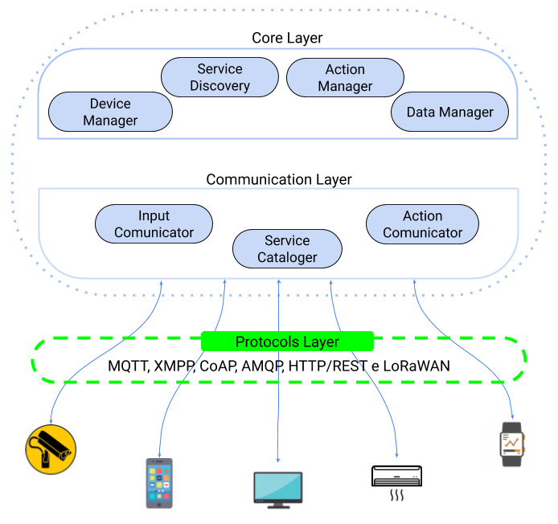

## Overview

The microservice-oriented middleware architecture for IoT is divided into **four layers**: the **main layer**, the **communication layer**, the **protocols layer** and the **physical layer**. In the main layer, there are the main microservices provided by the middleware. This layer does not perform direct communication with an external world. She manages the devices; manages performance tasks and data generated by devices. The communication layer is responsible for communicating with the external environment. She is responsible for discovering the devices; by entering data; for the communication of performance and for the cataloging of the services available for the applications. This layer passes all data to the main layer microservices and receives all submissions from the main layer microservices and passes it on to devices and applications.

## Microservices

The microservices that make up the middleware architecture layers are described below:

### Main Layer

The main layer of the architecture is responsible for managing and persisting the data that is received. In addition, the main layer has the objective of finding new services to make applications available.

* **Device Manager**: microservices responsible for cataloging and saving information about devices.

* **Service Finder**: microservices responsible for discovering services based on the data persisted by the devices.

* **Data Manager**: microservices responsible for persisting the data generated by the devices.

* **Action Manager**: microservices responsible for managing the actions scheduled by applications external to middleware.

### Communication Layer

The communication layer is responsible for receiving data from devices and/or applications and sending to microservices of the main layer, in addition to providing access to data and sending actuation commands to the actuating devices.

* **Input Communicator**: microservice responsible for the input communication of the middleware. All data sent by the devices is received by this microservice. This microservice receives data through many application protocols.

* **Action Communicator**: microservice responsible for sending actions to devices. This microservice sends performances over many application protocols.

* **Service Cataloger**: microservice responsible for intermediating the services provided by the main layer